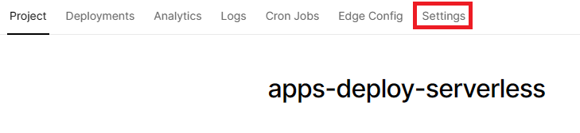

# Education Deploy Apps (Serverless Edition)

## Table of Content

- [Persyaratan Dasar](#persyaratan-dasar)
- [Disclaimer](#disclaimer)
- [Perkenalan](#perkenalan)
- [Serverless vs AWS EC2](#serverless-vs-aws-ec2)
- [Let's Demo](#lets-demo)
  - [Langkah 1 - Inisialisasi Project](#langkah-1---inisialisasi-project)
  - [Langkah 2 - Link Repository GitHub ke Vercel](#langkah-2---link-repository-github-ke-vercel)
  - [Langkah 3 - Inisialisasi Project Vercel di Komputer Lokal](#langkah-3---inisialisasi-project-vercel-di-komputer-lokal)
  - [Langkah 4 - Memperbaiki Kode](#langkah-4---memperbaiki-kode)
  - [Langkah 5 - Re-deploy Aplikasi](#langkah-5---re-deploy-aplikasi)
  - [Langkah 6 - Set Environment Variable (Lokal)](#langkah-6---set-environment-variable-lokal)
  - [Langkah 7 - Set Environment Variable (Production) dan Finishing](#langkah-7---set-environment-variable-production-dan-finishing)

## Persyaratan Dasar

- Mengerti perintah dasar pada Linux
- Sudah menginstall nodejs dan memiliki akun Github
- Memiliki akun Vercel yang sudah ter-link dengan akun Github
- Mengerti penggunaan command line `git`

## Disclaimer

Pada pembelajaran ini sudah disediakan sebuah kode sederhana yang sudah disiapkan untuk di-deploy. Kode ini dibuat dalam `nodejs`.

Apabila belum membuat akun `Vercel`, sangat disarankan untuk `Login with Github` dalam pembelajaran ini agar cepat terkoneksi dengan `Vercel`.

Demo aplikasi akhir-nya bisa dilihat di:

- https://apps-deploy-serverless.vercel.app
- https://apps-deploy-serverless.vercel.app/api

## Perkenalan

Pada pembelajaran sebelumnya (https://github.com/withered-flowers/education-deploy-apps-aws) kita sudah belajar bagaimana cara mendeploy aplikasi Backend yang kita miliki dengan menggunakan AWS dan bagaimana cara untuk mengkonfigurasi domain yang ada.

Pada pembelajaran ini kita akan mencoba untuk mendeploy aplikasi Backend yang kita miliki, berbasis express, pada Vercel, dalam bentuk serverless yah !

## Serverless vs AWS EC2

Perbedaan paling mendasar antara ketika kita menggunakan EC2 dengan menggunakan Serverless adalah "provisioning"-nya.

Provision artinya adalah setting infrastruktur IT-nya, adalah perbedaan paling signifikan antara EC2 dengan Serverless.

Pada EC2, infrastrukturnya kita buat sendiri, kita set sendiri, kemudian kita akan setting semuanya sendiri, hal ini umumnya disebut dengan **IaaS** (`Infrastructure as a Service`).

Sedangkan pada Serverless, infrastruktur, jaringan, scaling-nya, semuanya diatur oleh sistem yang sudah disediakan. Sehingga fokusnya kita hanyalah berdasarkan pada kode yang ada saja.

Loh, kalau begitu, sebenarnya mirip dengan `Railway` ataupun `Heroku` yah?

Agak mirip dengan `Railway` dan `Heroku`, walaupun pada keduanya, kita masih harus memilih infrastruktur pada awalnya (Processor yang berapa dan Memorynya berapa). Hal ini umumnya disebut dengan **PaaS** (`Platform as a Service`).

Jadi ada 3 hal yang bisa disimpulkan:

- AWS EC2, Provision sendiri, scaling sendiri disebut dengan **IaaS**
- `Railway` dan `Heroku`, Pilih Infrastruktur-nya sendiri, namun di-manage oleh sistem, scaling harus mandiri, disebut dengan **PaaS**
- Yang satu lagi, semuanya benar benar diurus sistem, kita hanya perlu menuliskan codenya saja, tapi tidak ada kontrol atas infrastrukturnya sama sekali, hal ini disebut dengan **Serverless**

Ada satu lagi yang umumnya menjadi "daya tarik" yang signifikan untuk serverless:

- Pada serverless, code yang dijalankan umumnya hanya berupa sebuah (atau beberapa) **fungsi** yang dijalankan saja, sehingga umumnya disebut juga dengan **Serverless Function**

Nah provider yang menyediakan **Serverless** ini ada apa saja?

Sebenarnya pada AWS maupun Google sendiri menyediakan produk untuk serverless dengan nama `AWS Lambda` maupun `GCP Cloud Function`.

Selain itu sebenarnya ada alternatif lainnya yang cukup populer, yaitu: `Netlify` dan `Vercel`.

Pada pembelajaran ini kita akan mencoba untuk deploy aplikasi berbasis Express yang kita miliki dengan menggunakan **Serverless Function** pada `Vercel`.

## Let's Demo

Pada demo pembelajaran ini kita akan melakukan deploy aplikasi sederhana berbasis Express dengan menggunakan `Vercel`.

Pada demo ini kita akan mengubah kode-nya sedikit agar bisa dideploy dengan cara `Serverless` pada `Vercel`

**Disclaimer:**

- Untuk deploy serverless function **UNTUK SETIAP PROVIDER AKAN MEMILIKI CARANYA TERSENDIRI**.
- Cara yang digunakan di sini adalah cara untuk mendeploy pada `Vercel`, bila menggunakan yang lain akan ada penyesuaian tersendiri yah !

### Langkah 1 - Inisialisasi Project

1. Untuk bisa mendeploy aplikasi kita pada Vercel, dibutuhkan sebuah repository git (Github / Gitlab / Bitbucket). Pada pembelajaran ini kita menggunakan Github yah.
1. Membuat sebuah repository kosong yang baru pada provider git dengan nama apapun

   asumsi:

   - Nama user github: `nama-user-sendiri`
   - Nama repo: `nama-repo-sendiri`
   - Protocol: `https` (untuk SSH disesuaikan sendiri yah)

1. Memasukkan perintah berikut pada terminal yang digunakan:

   ```sh
   # Clone Repo
   git clone https://github.com/withered-flowers/education-deploy-apps-serverless

   # Masuk ke Folder Clone
   cd education-deploy-apps-serverless

   # Masuk ke folder kode
   cd sources/a-start

   # Inisialisasi Git
   git init

   # Melakukan add dan commit untuk Repo
   git branch -M main
   git add .
   git commit -m "feat: initial commit"

   # Menambahkan origin ke github
   git remote add origin \
      https://github.com/nama-user-sendiri/nama-repo-sendiri.git

   # Push ke github
   git push -u origin main
   ```

1. Sampai pada titik ini, seharusnya pada repo `nama-repo-sendiri` yang ada di akun Github, sudah ada code yang berisi app.js dan lain lainnya ini. Selamat, Anda baru saja melakukan push code ke Github !

Langkah selanjutnya adalah, kita akan mengikat (binding) repository yang kita miliki (di GitHub) ke Project yang akan di auto-deploy (di Vercel)

### Langkah 2 - Link Repository GitHub ke Vercel

DISCLAIMER:

- Untuk mengikat repo ke project, kita akan membutuhkan browser yah !

Pada langkah ini, kita akan mengikat repo di GitHub dengan sebuah Project yang ada di Vercel.

Langkahnya adalah sebagai berikut:

1. Buka web Vercel (`https://vercel.com`) dan login
1. Pada halaman Dashboard yang ditampilkan, Pada sebelah kanan, pilih `Add New...` -> `Project` dan kita akan diminta untuk meng-import repository Git.
1. Pilih repository yang baru saja dibuat di atas, kemudian tekan tombol `Import` dan kita akan dipindahkan ke halaman `Dashboard` untuk melakukan konfigurasi.
   
1. Tanpa perlu ada yang dikonfigurasikan, maka kita akan langsung menekan tombol `Deploy`
   
1. Kemudian tunggu sebentar dan hasilnya adalah, **YES !** Aplikasi Express kita sudah terdeploy ! Bahkan sudah mendapatkan domain secara gratis !

   (Harap domainnya di-ingat yah, karena nanti akan kita gunakan lagi)

   Tapi tunggu sebentar...

   Ternyata kode yang kita tuliskan ada yang error sehingga tidak bisa berjalan dengan baik nih... 😭

   Maka langkah selanjutnya adalah kita akan mencoba untuk melakukan _troubleshooting_, dengan menjalankan kode yang sudah dibuat ini, di komputer local yang kita miliki.

   Oleh karena itu sekarang kita akan menggunakan `Vercel CLI`.

### Langkah 3 - Inisialisasi Project Vercel di Komputer Lokal

Karena kita menggunakan `Vercel`, maka sekarang kita harus membaca terlebih dahulu, bagaimana cara menggunakan dan mengembangkan aplikasi dengan `Vercel` terlebih dahulu.

Pada dokumentasi Vercel, ternyata disebutkan untuk bisa mengembangkan `Serverless Function`, maka kita bisa melakukannya secara local (pada komputer kita sendiri) dengan menggunakan `Vercel CLI`.

Langkah-langkah nya adalah sebagai berikut:

1. Install `Vercel CLI` dengan cara menggunakan perintah berikut:

   - [npm] `npm i -g vercel@latest`
   - [yarn] `yarn global add vercel@latest`
   - [pnpm] `pnpm i -g vercel@latest`

   (Sesuaikan dengan package manager pada nodejs yang digunakan yah !)

1. Login pada vercel-cli dengan menggunakan perintah:

   ```bash
   # Login
   vercel login

   # Login
   #>Log in to vercel github

   # Browser akan terbuka dan silahkan login github
   #>Success! GitHub authentication complete for xxxxxxx@yyyyyyy.zzz
   #>Congratulations! You are now logged in. In order to deploy something, run `vercel`.
   #>Connect your Git Repositories to deploy every branch push automatically (https://vercel.link/git)
   ```

1. Selanjutnya kita akan melakukan linking project yang ada di komputer kita dengan project yang ada di Vercel yang barusan kita buat. Hal ini bisa dilakukan dengan perintah:

   ```bash
   # Buka kembali project apps nya kita

   # Link project
   vercel link

   #?Set up "/nama/project/apps/kita/sources/a-start"?
   #>Yes

   #?Which scope should contain your project?
   #>Nama Organization Pada Vercel

   #?Link to existing project?
   #>Yes

   #?What's the name of your existing project?
   #>Nama Project Yang Ada di Vercel
   #>(Pada contoh ini berdasarkan foto di atas, adalah `apps-deploy-serverless`)

   #>Linked to xxxxx/apps-deploy-serverless (created .vercel)
   ```

1. Buka file **.gitignore** yang ada, kemudian tambahkan `.vercel` pada baris terbawah di file ini.

1. Sampai di titik ini, artinya kita sudah siap untuk menjalankan aplikasi kita. Selanjutnya kita akan coba untuk menjalankan kode kita di komputer dengan perintah

   ```bash
   vercel dev
   ```

   Mari kita lihat apa hasilnya....

   Masih juga error... 😭

   Dan output errornya adalah:

   ```
   Vercel CLI xx.xx.xx
   Error: Your `package.json` file is missing a `build` property inside the `scripts` property.
   Learn More: https://vercel.link/missing-build-script
   ```

   Maka sampai di titik ini kita akan coba untuk memperbaiki kode yang kita miliki supaya bisa berjalan dengan baik !

### Langkah 4 - Memperbaiki Kode

Pada langkah ini kita akan mencoba untuk memperbaiki kode yang sudah dibuat sebelumnya agar bisa menjalankan `Serverless Function` yang digunakan dalam Vercel ini dengan baik.

Untuk itu kita harus mengetahui terlebih dahulu bagaimana sebuah `Serverless Function` bekerja di dalam Vercel.

Dokumentasi:

- https://vercel.com/docs/concepts/functions/serverless-functions/quickstart

Di dalam Vercel `Serverless Function` didefinisikan sebagai berikut:

1. Di dalam sebuah folder yang bernama `api` (`/api`),
1. Kemudian akan membaca sebuah file yang berisi function, mis: `handler.js` (`/api/handler.js`)
1. kemudian ketika aplikasi dijalankan (`vercel dev`) ataupun di-deploy, akan dibaca di dalam `http://nama.domain/api/nama-file-function` (`http://localhost:3000/api/handler`)

Di sini umumnya sifat dari `Serverless Function` itu adalah:

- Kecil
- Biasanya fungsi lebih dari satu
- Untuk keperluan yang spesifik per fungsinya

Karena itu, pada saat kita ingin menggunakan `Serverless Function` untuk menjalankan `Express` ini, sebenarnya cukup `anti-pattern` dari sifat umumnya.

Hal ini pun tersirat dalam dokumentasi Vercel (setelah ditranslasikan):

> Ketika kita melakukan deploy sebuah server (aplikasi berbasis Express) di dalam Serverless Function, kita akan menjalankan implementasi server secara penuh di dalam setiap request. Ini adalah suatu anti-pattern, karena Serverless Function seharusnya hanya menyediakan satu tujuan saja.

Namun... apalah daya, karena ini cara yang sangat baik untuk belajar `Serverless Function`, bukan?

(Dan satu lagi, karena bisa gratis untuk skala yang cukup besar 😈).

Tapi selain itu, ada juga _caveat_ ketika kita mendeploy full aplikasi Express kita di dalam Serverless Function, untuk penjelasannya bisa dibaca di dokumentasi di bawah ini:

- https://vercel.com/guides/using-express-with-vercel#drawbacks-and-edge-cases

Oke sudah cukup tentang pengertiannya, mari kita coba untuk memperbaiki kodenya.

**Disclaimer**

- Cara ini digunakan setelah membaca API Reference yang ada, sehingga berbeda dengan dokumentasi yang diberikan di atas yah.

Langkah langkahnya adalah sebagai berikut:

1. Memindahkan kode kita yang semula ada pada `/src/sources/a-start` menjadi `/src/sources/a-start/api` KECUALI folder `.vercel` yang dibuat oleh Vercel

   Kira kira struktur foldernya menjadi seperti berikut:

   ```
   # Folder /sources/a-start

   .git
   .gitignore
   .vercel
   api/
      app.js
      node_modules/
         ...
      package.json
      pnpm-lock.yaml (bila menggunakan pnpm)
      yarn.lock (bila menggunakan yarn)
      package-lock.json (bila menggunakan npm)
      services/
         jsonplaceholder.js
   ```

1. Mengganti nama file `app.js` (`/sources/a-start/api/app.js`) menjadi `index.js` (`/sources/a-start/api/index.js`)

1. Memodifikasi kode `index.js` menjadi sebagai berikut:

   ```js
   import cors from "cors";
   import express from "express";

   import { fetchTodos } from "./services/jsonplaceholder.js";

   const app = express();
   // TODO: Serverless Function - Modifikasi Kode (1)
   // port sudah tidak digunakan lagi di dalam aplikasi
   // jadi boleh di comment saja
   // const port = process.env.PORT || 3000;

   app.use(cors());
   app.use(express.urlencoded({ extended: false }));
   app.use(express.json());

   app.get("/", (req, res) => {
     res.status(200).json({
       statusCode: 200,
       message: "echo OK",
       environmentSecret: process.env.SECRET ?? "Secret not Provided",
     });
   });

   app.get("/api", async (req, res) => {
     const data = await fetchTodos();

     res.status(200).json({
       statusCode: 200,
       data,
     });
   });

   // TODO: Serverless Function - Modifikasi Kode (2)
   // Pada aplikasi berbasis Serverless Function
   // Umumnya kita hanya akan mengexport Function saja
   // (Jadi di dalam kodenya, tidak ada runner / main function yang dijalankan sama sekali)
   // Sama dengan aplikasi express ini, jadinya tidak boleh ada listen
   // Di comment saja listennya
   // app.listen(port, (_) => console.log(`apps is listen @ port ${port}`));

   // TODO: Serverless Function - Modifikasi Kode (3)
   // Sebagai gantinya, di sini kita harus export Function kita
   // Karena di sini di-treat sebagai module (package.json -> type: "module")
   // Maka di sini menggunakan export default

   // Apabila di treat sebagai non-module (CJS),
   // Maka gunakan "module.exports = app;"
   export default app;
   ```

1. Menambahkan file `vercel.json` (`/sources/a-start/vercel.json`), kemudian menambahkan kode berikut:

   ```json
   {
     "routes": [
       {
         "src": "/(.*)",
         "dest": "/api"
       }
     ]
   }
   ```

   Maksud dari konfigurasi ini adalah kita akan meminta pada Vercel untuk membaca seluruh routing dari endpoint yang nantinya diberikan (http://localhost:3000/(seluruhnya)) untuk membaca dari folder `/api`

1. Coba jalankan perintah `vercel dev` ulang, dari lihatlah hasilnya:

   - http://localhost:3000/ ataupun
   - http://localhost:3000/api

   Seharusnya sampai pada tahap ini kode yang dituliskan sudah bisa berjalan dengan baik.

Sampai di langkah ini, seharusnya pada tahap development yang kita lakukan, hal ini sudah berjalan dengan baik.

Maka selanjutnya kita akan melakukan hal yang lainnya lagi, re-deploy aplikasi

### Langkah 5 - Re-deploy Aplikasi

Pada langkah ini kita akan melakukan re-deploy aplikasi yang sudah dimodifikasi tadi, ke dalam Vercel.

Kira kira bagaimana caranya yah? 🤔

Langkahnya adalah sebagai berikut:

1. Pindah ke folder yang berisi kode kita (`/sources/a-start`)
1. Lakukan `git add`, `git commit` dan `git push`
1. Tunggu 15 detik...
1. Buka kembali web dengan domain yang sudah diberikan oleh Vercel, dan _voila_ kode sudah diupdate di GitHub, dan secara otomatis **LANGSUNG DI-RE-DEPLOY** oleh Vercel. Mantap bukan?

   > (**Uhuk**, ini backend loh padahal, **uhuk**)

Sampai dengan langkah ini, aplikasi yang dibuat sudah dideploy dengan baik, hanya saja masih ada sedikit error yah, yaitu pada endpoint `/`, sebenarnya dibutuhkan suatu `environment variable` atau `env` dengan nama `SECRET` yang belum di-set yah.

Nah selanjutnya kita akan mencoba untuk meng-set `env` nya dengan menggunakan ala Vercel ini.

### Langkah 6 - Set Environment Variable (Lokal)

Pada langkah ini kita akan mencoba untuk menggunakan `env` secara lokal (di dalam komputer kita sendiri).

Di dalam `Vercel` dan Provider Serverless lainnya, umumnya `env` akan terbagi menjadi 2 bagian:

- `Development` - `env` yang ada pada saat kita mengembangkan aplikasi (`vercel dev`)
- `Production` - `env` yang ada pada saat kita deploy aplikasi

(`Preview` tidak dijelaskan di sini, karena yang dituju adalah yang umum ada)

Disclaimer:

- Langkah ini menggunakan UI dan bukan CLI, karena umumnya pada saat `env` local / production dalam tim, kita berharap ada sentralisasi `env` sehingga menggunakannya enak bukan?

Langkah-langkahnya adalah sebagai berikut:

1. Buka kembali Dashboard pada situs `vercel.com`, kemudian pilih Project yang kita buat
1. Pada tab navigasi yang ada, pilih `Settings`

   

1. Pada tab navigasi `Project Settings`, pilih `Environment Variables`

   

1. Masukkan Environment variabel dengan key dan value yang diinginkan

   mis: key adalah **SECRET** dan value adalah **ENV_VALUE_DEVELOPMENT**

   Jangan lupa untuk mencentang Environment `Development` karena kita hanya akan meng-set ini untuk local saja

   (Dengan asumsi value untuk `Production` berbeda dengan `Development`)

   

1. Buka terminal

1. Lakukan cd pada terminal sampai ke folder project Vercel (`/sources/a-start/`)

1. Kemudian mari kita coba langsung jalankan dengan perintah

   ```
   vercel dev
   ```

1. Dan kemudian ketika kita membuka halaman development kita (`http://localhost:3000`), secara **MAGIC** `env` yang di-set di UI Browser sudah bisa masuk ke dalam aplikasi lokal kita, asik kan?

   Di balik layar, perintah `vercel dev` akan memasukkan `env` dari sistem Vercel ke dalam memori komputer, sehingga aman, dan tidak bisa dibaca (_encrypted_)

Sampai di sini kita sudah bisa mendevelop aplikasi kita dengan cukup damai. Sudah bisa mengambil `env` dari Vercel secara otomatis, sudah bisa langsung mengembangkan aplikasi.

Sekarang saatnya kita masuk ke tahap terakhir, yaitu Set Environment Variabel untuk Production dan Finishing

## Langkah 7 - Set Environment Variable (Production) dan Finishing

Pada titik ini, kita sudah bisa mengembangkan aplikasi yang dibuat dengan baik pada komputer lokal kita.

Namun pada saat membuka Production (https://xxxx.vercel.app), kita masih mengalami kejadian bahwa `env` untuk Production belum bisa dibaca dengan baik.

Hal ini terjadi karena memang kita belum meng-set `env` untuk production yah !

Pada Langkah terakhir ini kita akan meng-set `env` untuk production sekaligus finishing deployment yah.

Langkahnya adalah sebagai berikut:

1. Buka kembali Dashboard Vercel (https://vercel.com) dan pilih Project yang kita gunakan
1. Pilih navigasi `Settings`
1. Pada Project Settings, pilih `Environment Variables`
1. Masukkan Environment variabel dengan key dan value yang diinginkan

   mis: key adalah **SECRET** dan value adalah **INI_VALUE_PRODUCTION**

   Jangan lupa untuk mencentang Environment `Production` karena sekarang kita akan meng-set ini untuk Deployment, kemudian tekan tombol `Save`.

   Maka sekarang ini apabila dilihat, seharusnya sudah akan ada 2 Environment Variable dengan key yang sama, yaitu **SECRET**

   

1. Maka seharusnya sampai di sini sudah _donk_ ?

   Kita sudah selesai kan seharusnya?

   Mari kita coba buka webnya via browser yah.

   Dan yang terjadi adalah...

   Masih **Secret not provided** 😭

   Mengapa demikian?

   Hal ini terjadi karena pada saat mengganti `Environment Variable` dalam Production, maka umumnya yang harus dilakukan adalah kita harus **restart server**.

   Nah tapi ini kan Serverless, jadi bagaimana yah?

   Salah satu caranya adalah dengan melakukan commit dan push ulang code yang sudah kita buat, maka Vercel akan melakukan build dan deploy ulang, sehingga Environment Variable yang terbarunya pun terbaca.

1. Tapi ada cara lainnya, yaitu via `klik klak klik` pada Browser (apabila tidak ada perubahan kode).

   _Markicob_ yah.

   Kembali ke Browser dan buka Halaman Dashboard Project di Vercel, kemudian pilih tab `Deployments`

   

1. Pada halaman `Deployments` ini kita akan diberikan listing dari hasil deployment yang sudah pernah dibuat.

   Pilih Deployments yang ada tulisan `Production (Current)` nya, kemudian pilih hamburger menu (triple dot vertikal), lalu pilih `Redeploy`

1. Setelah ini akan muncul Dialog yang baru, centang `Redeploy with exisiting build cache` kemudian tekan tombol `Redeploy`

1. Tunggu kurang lebih 10 detik (karena aplikasi ini masih ringan), kemudian apabila sudah berhasil, buka web-nya di Browser

1. _Voila_ ! sekarang sudah ada environment variable-nya, tanpa perlu kita modifikasi kode ulang.

🥳🥳🥳 Yak sampai di sini kita sudah berhasil mendeploy kode kita yang berbasis Express, pada Vercel, sebagai `Serverless Function`. 🥳🥳🥳

Perlu sedikit diingat bahwa `Serverless Function` ini umumnya memiliki limitasi 10 detik per eksekusi yah, jadi pastikan, untuk tiap endpoint yang akan ditembak, selalu memiliki limitasi 10 detik saja !

Semoga bermanfaat dan Selamat ber-eksplorasi 😇
